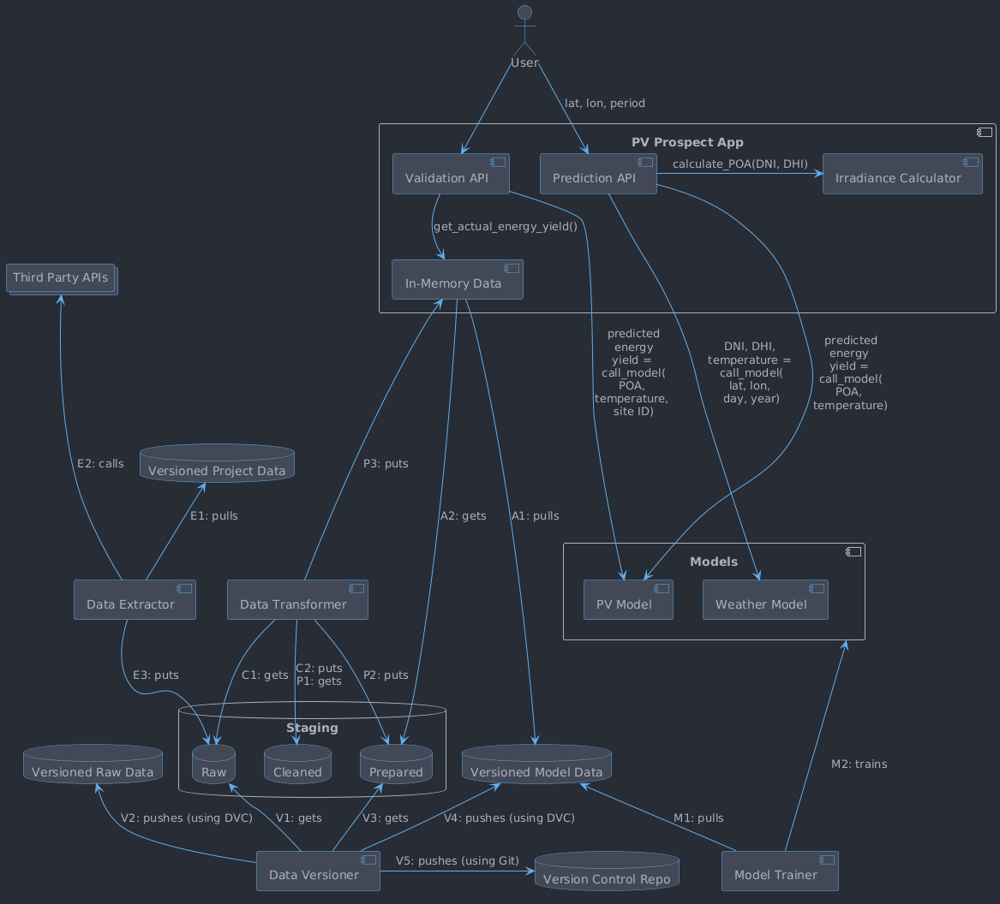

# pv-prospect

A model of photovoltaic (PV) power outputs according to weather in the UK. This may be
useful if you are thinking about installing solar panels and would like to know how much
energy you could get from them.

This is a work in progress.

## About the Model

The model is a pair of deep neural networks trained on the power output data of 10 existing
PV systems and corresponding weather data. The PV data has been kindly uploaded by the
system owners to [PVOutput](https://pvoutput.org/). Historical weather data is available
from [Open-Meteo](https://open-meteo.com/).

To predict energy yield, the model requires the following inputs:

* location (latitude and longitude)
* period (start and end dates)
* solar panel power rating
* azimuthal orientation (angle clockwise from North)
* tilt (angle from the horizontal)

From the location and period, the first neural network will predict a time series of
relevant weather variables such as temperature, direct normal irradiance (DNI) and
diffuse horizontal irradiance (DHI). From irradiance data and the solar panel features,
plane-of-array (POA) irradiance can be calculated. The second neural network will use
POA irradiance and other features to estimate power output over time.

Some caveats:

* The model does not factor in shade from trees and other obstacles. These
  could negatively impact the actual power output.
* The model is trained on systems that may have old or ageing technology.
  Newer technology could mean the actual power output is higher than expected.

## System Architecture

The pipeline is orchestrated around the following named flows:

| Key | Description           | When it happens    |
|-----|-----------------------|--------------------|
| E   | Data extraction       | Daily              |
| C   | Data cleaning         | When E finishes    |
| P   | Data preparation      | When C finishes    |
| A   | App data loading      | When App starts up |
| V   | Data/model versioning | Weekly             |
| M   | Model training        | When V finishes    |

### E — Data Extraction

Pulls weather data from the **Open-Meteo API** and PV power readings from the **PVOutput API**,
staging them as CSV to a GCS staging bucket (`raw/` prefix). Each run is scoped to a single
PV system and date range. Implemented in `pv-prospect-data-extraction`.

On GCP, extraction is triggered daily by Cloud Scheduler, orchestrated by Cloud Workflows,
and executed as Cloud Run Jobs. Locally it can be driven by the Docker Compose `runner` service.

### C — Data Cleaning

Cleans raw CSVs into Parquet (column selection, renaming, UTC time synthesis) and writes them
to the staging bucket (`cleaned/` prefix). All data sources must be cleaned before preparation
can begin. Implemented in `pv-prospect-data-transformation`.

### P — Data Preparation

Reads cleaned Parquet, performs feature selection, downsampling, joins weather with PV data,
and computes plane-of-array (POA) irradiance via `pvlib`. Writes prepared Parquet to the
staging bucket (`prepared/` prefix). Implemented in `pv-prospect-data-transformation`.

### A — App Data Loading

Loads versioned Parquet data and trained model weights into the application at startup.

### V — Data/Model Versioning

Snapshots prepared Parquet data and trained model artefacts on a weekly cadence,
producing a versioned dataset for the next training run.

### M — Model Training

Trains two neural networks from versioned Parquet data: one to predict weather variables
(temperature, DNI, DHI) from location and time, and another to predict PV power output from
POA irradiance and other features. Implemented in `pv-prospect-model`.
