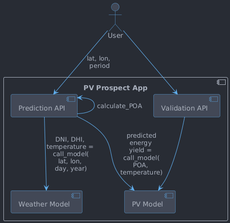

# PV Prospect

A model of photovoltaic (PV) power outputs according to weather in the UK. 
The website can be accessed [here](https://pv-prospect-app-iwge6y4a5q-nw.a.run.app/).

## About the Model

PV Prospect estimates the annual energy yield of a UK solar installation. The
result is a **typical-year climatological estimate** — not a forecast for a
specific year, but a long-run average learned from historical data.

Two neural networks are chained with a physics step between them:

1. **Weather model** — given location and time of year, predicts climatological
   values for direct normal irradiance (DNI), diffuse horizontal irradiance (DHI),
   and ambient temperature, learned from
   [Open-Meteo](https://open-meteo.com/) historical data.
2. **Solar geometry** — standard physics converts DNI and DHI into plane-of-array
   (POA) irradiance for the given panel orientation and tilt.
3. **PV model** — predicts daily capacity factor from POA irradiance and
   temperature; a fixed degradation factor (~0.7 %/year) is applied for panel age.
   Trained on generation data from 10 real UK systems shared on
   [PVOutput](https://pvoutput.org/).

**Inputs:**

* location (latitude and longitude)
* panel rating (W) and optional inverter rating (W)
* azimuthal orientation (degrees clockwise from North)
* tilt (degrees from the horizontal)
* installation age (years, optional)

**Uncertainty:** the annual yield estimate carries a ±17 % (1σ) uncertainty floor,
calibrated by leave-one-site-out cross-validation across the 10 training sites. It
captures site-to-site variability but excludes weather-year fluctuations and
real-world variation in shading, soiling, and roof condition. The training corpus is
self-selected by motivated system owners, so estimates are optimistic for an
arbitrary installation.

## System Architecture


The pipeline is orchestrated around the following named flows:

| Key | Description                      | When it happens    |
|-----|----------------------------------|--------------------|
| E   | Data extraction                  | Daily              |
| C   | Data cleaning                    | When E finishes    |
| P   | Data preparation (featurisation) | When C finishes    |
| A   | App data loading                 | When App starts up |
| V   | Data/model versioning            | Weekly             |
| M   | Model training                   | When V finishes    |

Each data source — here the Open-Meteo weather API and the PVOutput API —
has its own extraction (E) and cleaning (C) flow. Preparation (P)
then builds a *feature set* per model — here the weather model and the PV
model. The source-to-model mapping is not one-to-one: a feature set may draw
on several cleaned sources. The PV model's features join cleaned PV power with
cleaned on-site weather, whereas the weather model's features come from the
weather source alone — so the weather source feeds both feature sets.

### E — Data Extraction

Pulls weather data from the **Open-Meteo API** and PV power readings from the
**PVOutput API**, staging them as CSV to a GCS staging bucket (`raw/` prefix).
Each run is scoped to a single PV system and date range. Implemented in
`pv-prospect-data-extraction`.

On GCP, extraction is triggered daily by Cloud Scheduler, orchestrated by Cloud
Workflows, and executed as Cloud Run Jobs. Locally it can be driven by the Docker
Compose `runner` service.

### C — Data Cleaning

Cleans raw CSVs (column selection, renaming, UTC time synthesis) and writes them
as CSV to the staging bucket (`cleaned/` prefix). All data sources must be cleaned
before preparation can begin. Implemented in `pv-prospect-data-transformation`.

### P — Data Preparation

Reads cleaned CSVs, performs feature selection, downsampling, joins weather with PV
data, and computes plane-of-array (POA) irradiance via the shared
`pv-prospect-physics` package (`pvlib` under the hood) — shared so the prediction
API computes POA identically to training. The PV-side output
also carries `power_max` — the maximum of the native-cadence cleaned PV power over
each output row's period — derived before the time-weighted average to weather
cadence so that sub-hour clipping survives the reduction. Downstream model
training uses it as a censoring flag: rows whose `power_max` reaches the inverter
capacity have a biased daily-mean `power` and are dropped from the training set.
The prepared data is partitioned into **content-named CSV files** under two
segregated corpora in `prepared/`:

* `weather/weather_{start}_{end}_{gv}-{NN}.csv` — grid-point weather, consumed by
  the weather model.
* `pv/{site}/pv_{site}_{start}_{end}.csv` — PV power joined with on-site weather,
  consumed by the PV model.

`{start}` is inclusive and `{end}` exclusive (ISO `YYYY-MM-DD`); `{gv}` is the
grid-definition version (`0` now); `{NN}` is the zero-padded grid-point sample-file
index. Filenames describe the data they hold — there is no temporal version in any
path, since git tags own versioning — so each weekly versioning run *adds* `.dvc`
files rather than overwriting one, keeping the whole corpus retrievable with a
single `git checkout <tag> && dvc pull`. The daily transform fans `prepare_pv` out
across dates as micro-batch CSVs in `prepared-batches/`, then an assembly step
merges them into the partition files. After all prepare steps succeed, a final
`maintain_validation_window` step maintains a **rolling 90-day validation window**
artifact at `data/served/validation-window/` in the staging bucket:

* `window.csv` — all prepared PV rows for the last 90 days across every known site,
  with `system_id` prepended as the first column.
* `manifest.json` — updated timestamp, window bounds, and per-site row counts.

The window is a derived, regenerable serving cache separate from the DVC feature
store. The cutoff is data-relative (`max(time) − 90 days`) so a temporarily-offline
site is not immediately dropped. The `data/served/` prefix lies outside the weekly
clean's blast radius. No new IAM is needed — the pipeline SA already holds
`objectAdmin` on the staging bucket. The artifact must be seeded once before the
workflow step can run (see
[Seeding the Validation Window](#seeding-the-validation-window)).
Implemented in `pv-prospect-data-transformation`.

### A — App Data Loading

At startup, `pv-prospect-app`:

1. Downloads the promoted model artifacts from the model store
   (`gs://pv-prospect-versioned-model/promoted/` in production, or a local directory
   for development) and loads them into memory. The store is written by the model
   trainer's promote step (see M below). A failed model load is fatal — without models
   there is nothing to serve.
2. Loads the rolling 90-day validation window from
   `gs://<staging-bucket>/data/served/validation-window/` (see P above). A failed
   window load is non-fatal: `/predict` continues serving; `/validate/*` returns 503
   until the cache self-heals on the next request.
3. Builds the in-memory PV-site registry from
   `gs://<staging-bucket>/resources/pv_sites.csv`. Also non-fatal.
4. Loads the annual-mean **capacity-factor map** PNG from
   `gs://<staging-bucket>/assets/capacity-factor-map.png` into memory and serves it
   at `GET /assets/capacity-factor-map.png` for the home-page resource panel. Like
   the registry, this is a generated, model-dependent asset kept out of the deploy
   image, so its refresh cadence is decoupled from app deploys; the load is
   non-fatal (the panel hides itself if the asset is absent). It is produced
   offline by `pv-prospect-map` — see that package's README for the publish step.

A failed model load is fatal; the other three are non-fatal. Items 2–4 read from
the staging bucket via the same `objectViewer` grant, so no new IAM is needed.

Per-request freshness: before each `/validate/{system_id}` call, the app compares
the in-memory manifest's `updated_at` against the live manifest on GCS. If the
producer has written a fresher window since startup, the app reloads it on the spot.
The check reads only the small manifest file, so unchanged requests pay no I/O cost.

How these loaded models serve requests — the prediction and validation flows — is
covered in the **App Serving** section below.

### V — Data Versioning

Snapshots prepared CSV data on a weekly cadence: stages `.dvc` files pointing at
the prepared-feature corpus and pushes them to `gs://pv-prospect-versioned-feature`,
then commits and tags `data-v<date>` in the instance repo. Implemented in
`pv-prospect-data-versioner`.

The versioner is **accumulate-only**: it `dvc add`s the latest staging output onto
the existing corpus (overwriting by path) and never removes a partition. So the
corpus at a `data-v<date>` tag is the union of every producer's output to date, and
**a full re-base onto a new feature convention cannot be produced by re-running the
pipeline** — any un-regenerated window stays on the old basis. That case needs an
explicit clean rebuild: see
[`pv-prospect-data-transformation/doc/runbooks/re-base-corpus.md`](pv-prospect-data-transformation/doc/runbooks/re-base-corpus.md).

### M — Model Training

Triggered automatically by the version workflow (V) on success. The model trainer
(`pv-prospect-model-trainer`):

1. Clones `pv-prospect-instance` at the `data-v<date>` tag and `dvc pull`s the
   prepared corpus.
2. Trains two neural networks (`pv-prospect-model`): a weather model (temperature,
   DNI, DHI from location + time) and a PV model (capacity factor from POA
   irradiance, temperature, age).
3. Runs a **promotion gate** — compares the new model's clamped-power R² against
   the incumbent. If the new model degrades beyond the configured tolerance, it is
   rejected and the incumbent continues serving.
4. If promoted: `dvc add`s the artifacts, pushes to `gs://pv-prospect-versioned-model`
   (DVC lineage), copies the 4-file serving artifacts to the `promoted/` prefix
   (plain GCS, read by A), commits `models/current.json` + `models/provenance.json`,
   and tags `model-v<date>` in the instance repo.

## App Serving



`pv-prospect-app` is the product's front door. It serves a **no-build demo
website** from `/` — static HTML plus vanilla JS with CDN Leaflet (map) and uPlot
(charts), mounted at `/static` and calling the JSON endpoints same-origin (no
CORS, no build step) — fronting the two serving surfaces as browser tabs:

* **Prediction** — click a UK map point and enter panel parameters (capacity,
  azimuth, tilt, age, optional inverter). The page calls `POST /predict` and
  renders the expected annual yield with its uncertainty band (the ±17 % 1σ
  per-site level floor, calibrated by the cross-site LOSO eval — see the
  `pv-age-feature` report), a monthly bar chart, and the response's own
  `caveats[]`.
* **Validation** — pick a known site (listed dynamically by
  `GET /validate/sites`) and see predicted-vs-actual daily output over the
  rolling 90-day window from `GET /validate/{system_id}`, with the in-sample
  caveat surfaced verbatim.

Behind the surfaces (diagram above), `POST /predict` takes a location (latitude
and longitude) and a period:

1. The **weather model** predicts a time series of DNI, DHI, and temperature from location and time.
2. POA irradiance is computed from the irradiance components and the user-supplied panel geometry (shared `pv-prospect-physics` package — same computation as used during preparation).
3. The **PV model** estimates capacity factor from POA and temperature, yielding predicted energy output.

`/validate/{system_id}` runs the PV model over the validation window for the
specified site and returns predicted vs. actual power output.

See `pv-prospect-app` for the `/predict`, `/healthz`, `/version`,
`/validate/sites`, and `/validate/{system_id}` endpoints. The committed
`openapi.yaml` is the canonical contract the UI binds to; FastAPI also serves it
live at `/docs`. The service is **public by default** (per-IP rate limiting on
`/predict` and `/validate/*` baked into the image guards against Open-Meteo quota
burn and self-DoS; `/healthz` and `/version` are exempt). To return to private,
set `allow_unauthenticated = false` in `terraform.tfvars` and re-apply.

## Operational Workflows

The automated pipeline is driven by Cloud Scheduler cron jobs that execute Cloud
Workflows on a daily or weekly basis:

* **Daily Extraction (`pv-prospect-extract`)**: Runs at **02:00 UTC**. Triggers
  the data extraction workflow for the previous day.
* **PV-Sites Extraction Backfill (`pv-prospect-extract-pv-sites-backfill`)**: Runs
  at **02:40 UTC**. Orchestrates daily PV-site backfill for historical data,
  covering a 28-day window that marches backwards through history. Extracts PV
  output sequentially (one Cloud Run Job per site) and weather data in parallel.
  A **GCS position checkpoint** (`tracking/checkpoints/pv_sites_backfill.json`,
  a small `{"next_pv_task_index": N}` document) is written after each dispatched
  PV task, so a manually re-triggered run resumes from where the previous
  execution stopped rather than starting over. The checkpoint is deleted on
  successful completion.
* **Weather-Grid Extraction Backfill (`pv-prospect-extract-weather-grid-backfill`)**:
  Runs once daily at **03:20 UTC**. Orchestrates the daily grid-point weather
  backfill via a paced manifest-driven process: 9 batches dispatched sequentially
  in a single workflow execution, separated by `sleep_seconds_between_batches`
  (default 720 s = 12 min). The in-batch sleep is what keeps the workflow under
  Open-Meteo's 5,000 requests/hour limit — a sliding 60-minute window covers at
  most ~3 batches × 1,330 calls ≈ 3,990 calls. Total wall time ≈ 3 h 24 min;
  the cursor commits once every batch has been attempted, so a workflow-level
  failure rolls back the day cleanly (tomorrow re-plans the same window).
* **Data Transformation (`pv-prospect-transform`)**: Runs at **05:30 UTC**.
  Orchestrates the data cleaning and preparation steps to generate the prepared
  datasets for all data extracted earlier in the day. On success, runs
  `maintain_validation_window` (see P above) and `consolidate_logs` as
  post-pipeline cleanup steps.
* **PV-Sites Transformation Backfill (`pv-prospect-daily-transform-pv-sites-backfill`)**:
  Runs at **06:00 UTC**. Unlike the other pipelines, this one has no Cloud
  Workflow — Cloud Scheduler invokes the `data-transformation` Cloud Run Job
  directly with `JOB_TYPE=run_transform_backfill`. The job plans, runs (with per-slice thread-pool parallelism: each slice runs
  clean → prepare → assemble entirely in memory and writes one prepared
  partition file directly, without intermediate `cleaned/` writes), flushes
  its run ledger to a single consolidated file, and commits the marker — all
  in a single execution. Plans its work from the PV-sites extraction
  backfill's committed task-outcome ledger: completed extraction entries gate
  which slices are ready to transform. A small **consumed-through marker**
  bounds each run to the next `MAX_EXTRACT_RUNS` (default 4) unconsumed
  extraction ledgers; the marker advances at the end of the run only after
  every slice has been attempted (an exit-2 terminating error skips the
  commit). Per-slice failures are logged-and-swallowed, so a
  transiently-failed slice is a recorded hole rather than a perpetual retry.
* **Weather-Grid Transformation Backfill
  (`pv-prospect-daily-transform-weather-grid-backfill`)**: Runs at **08:00 UTC**.
  Same pattern as above but planning from the weather-grid extraction
  backfill's ledger (weather-only task graph). Uses an independent marker so
  it can advance separately from the PV-sites transform backfill. The start
  time sits past the weather-grid extract's ~06:44 finish + consolidation, so
  the planner always sees a consolidated ledger to read from.
* **Data Versioning + Model Training (`pv-prospect-version` workflow)**: Runs weekly
  at **Sunday 23:00 UTC**. A two-step Cloud Workflow:
  1. **Data versioner** (`data-versioner` Cloud Run Job): snapshots the prepared CSV
     corpus, pushes to `gs://pv-prospect-versioned-feature`, commits and tags
     `data-v<date>` in the instance repo.
  2. **Model trainer** (`model-trainer` Cloud Run Job): clones the instance repo at
     the new data tag, pulls the corpus, trains both models, runs the promotion gate,
     and if promoted: pushes artifacts to `gs://pv-prospect-versioned-model`, commits
     `model-v<date>`. The model trainer always runs after the versioner step, even if
     the versioner's Cloud Run status reports non-success (the versioner has a known
     hang-on-exit bug — see `briefs/versioner-hang.md` — that reports failure despite
     completing all work; the trainer self-verifies by cloning the `data-v<date>` tag).

* **Prediction & Validation API + Website (`pv-prospect-app`)**: A Cloud Run Service
  that loads the promoted model artifacts from `gs://pv-prospect-versioned-model/promoted/`
  at startup and serves the prediction (`/predict`), validation (`/validate/sites`,
  `/validate/{system_id}`), and health/metadata (`/healthz`, `/version`) endpoints,
  plus a no-build demo website at `/` (see the **App Serving** section above).
  Scale-to-zero with `max_instances=2`. Public by default (per-IP rate limiting
  on `/predict` and `/validate/*` is baked into the image). To restrict to IAM
  auth, set `allow_unauthenticated = false` in `terraform.tfvars` and re-apply.

> **Scheduling rationale**: The daily extraction and PV-sites extraction backfill
> both use the PVOutput API, which rate-limits at 300 requests/hour. With
> individual Cloud Run Job tasks capped at 30 minutes, a 40-minute gap between
> each PVOutput-using workflow prevents concurrent API calls that could breach
> this limit. The weather-grid extraction backfill uses OpenMeteo exclusively,
> but its 9 daily batches breach the 5,000 requests/hour limit if run in a single
> window — so it is split across two windows 70 minutes apart. The transformation
> workflows do not call any external API, so they can run back-to-back; they are
> scheduled after all extraction runs have safely completed.

### Deploying the App & Going Public

`pv-prospect-app` runs as a Terraform-managed Cloud Run Service; there is no CD
pipeline, so deploys are manual. Build and push the image (the build context is
the **submodule root**, so the shared local packages resolve), then apply:

```bash
# From the pv-prospect submodule root
gcloud builds submit --config pv-prospect-app/cloudbuild.yaml .

cd terraform && terraform apply        # rolls out the new revision
```

`cloudbuild.yaml` sets the image tag (using Cloud Build's `$PROJECT_ID` substitution)
and enables BuildKit. The build context is `.` (submodule root) so the shared local
packages are visible to the Dockerfile's `COPY` instructions.

The static website assets are baked into the image (`pv_prospect/app/static/`),
and the promoted models load **at startup** — so picking up new static assets
*or* a freshly promoted `model-v<date>` both require a new revision (the
`terraform apply` above, or any redeploy that restarts the container).

**Public by default.** The service is public by default
(`allow_unauthenticated = true` in `terraform/variables.tf`), protected by
per-IP rate limiting baked into the image: `POST /predict` and `GET /validate/*`
are limited (default 20 req/min and 30 req/min respectively); `/healthz` and
`/version` are exempt. This guards against Open-Meteo quota burn (every novel
coordinate on `/predict` makes one elevation lookup) and self-DoS of the
2-instance service. Limits are tunable via `RATE_LIMIT_PREDICT` /
`RATE_LIMIT_VALIDATE` env vars without a redeploy. To return to private, set
`allow_unauthenticated = false` in `terraform.tfvars` and re-apply.

### Trigger the Pipeline Manually (Optional)

You can trigger an ad-hoc run using the `gcloud` CLI:

```bash
gcloud workflows run pv-prospect-extract \
  --location=europe-west2 \
  --data='{"pv_system_ids": [12345], "date": "2025-06-24"}'
```

#### Resuming the PV-Sites Extraction Backfill after a timeout

If `pv-prospect-extract-pv-sites-backfill` is interrupted (e.g. the Cloud Workflows
execution times out or is cancelled), simply re-trigger it:

```bash
gcloud workflows run pv-prospect-extract-pv-sites-backfill \
  --location=europe-west2
```

The workflow will read the position checkpoint at
`gs://<staging-bucket>/tracking/checkpoints/pv_sites_backfill.json` and resume
dispatching from `next_pv_task_index`, logging `"Resuming from checkpoint --
starting at PV task N"`. No duplicate extraction occurs. The checkpoint is
deleted automatically once the full run completes, so the next scheduled run
starts from scratch.

#### Re-triggering the Weather-Grid Extraction Backfill after a failure

The weather-grid backfill has **no per-batch checkpoint** — it runs as a single
linear pass that paces 9 batches across ~3 h 24 min and commits the cursor only
once every batch has been attempted. A workflow-level failure (or a deliberate
re-trigger before the scheduler fires) therefore leaves the cursor at
yesterday's position; the next run re-plans the same window from scratch. The
cost of a re-trigger is roughly 3 hours of OpenMeteo budget, but in exchange
there is no checkpoint-shaped coordination surface for concurrent same-day
executions to race on.

```bash
gcloud workflows run pv-prospect-extract-weather-grid-backfill \
  --location=europe-west2
```

#### Resuming a Transformation Backfill after a timeout

The transform backfills run as Cloud Run Job executions (not workflows), so
re-trigger them directly:

```bash
gcloud run jobs execute data-transformation \
  --region=europe-west2 \
  --update-env-vars=JOB_TYPE=run_transform_backfill,BACKFILL_SCOPE=pv_sites
```

(Use `BACKFILL_SCOPE=weather_grid` for the weather-grid backfill.)

The consumed-through marker is only advanced at the end of a successful run,
so a run that crashed before commit re-derives the same plan from the
extraction ledger on re-trigger. If the prior attempt reached its end-of-run
ledger flush, the orchestrator's `filter_remaining_tasks` reads that
consolidated ledger and the re-run skips the finished units; an attempt that
crashed before the flush re-runs every unit — the clean/prepare/assemble steps
overwrite idempotently, so that is safe, just repeated work. To deliberately
replay one or more windows (e.g. to plug a hole left by a buggy run, or to
re-transform after a feature-spec change), follow
[`pv-prospect-data-transformation/doc/runbooks/replay-window.md`](pv-prospect-data-transformation/doc/runbooks/replay-window.md):
marker rewind alone is filtered out by the cross-run resume scan, so the
offending consolidated ledger has to leave the scan root as well.

### Seeding the Validation Window

The `maintain_validation_window` workflow step is fail-closed: it raises if the
artifact does not already exist. Before enabling the daily workflow step, seed the
window once from the locally-pulled DVC prepared corpus:

```bash
# In pv-prospect-instance — pull only the recent PV partitions.
# Adjust the date threshold to suit; 90 days back from today is sufficient.
dvc pull data/prepared/pv/

# In pv-prospect (submodule)
cd util/seed-validation-window
poetry install
poetry run seed-validation-window \
  --prepared-dir ../../../data/prepared \
  --window-dest gs://pv-prospect-staging/data/served/validation-window \
  --days 90
```

`seed-validation-window` writes `window.csv` + `manifest.json` to the
specified destination. Use a local path for `--window-dest` to dry-run
locally before writing to GCS.
