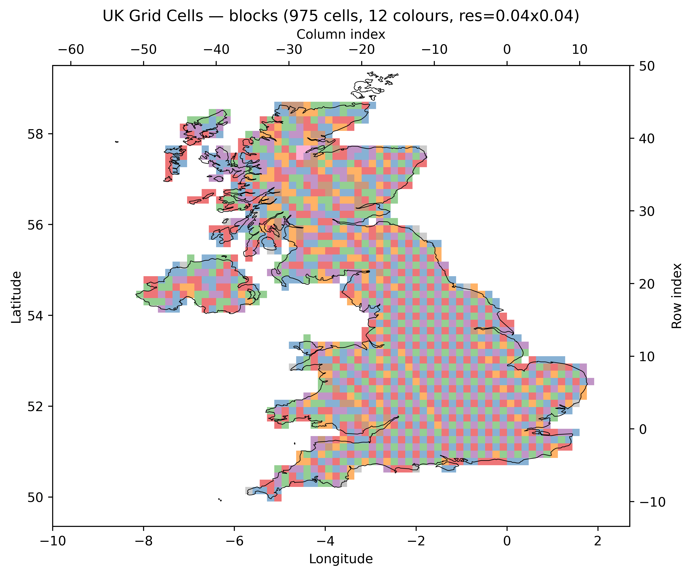
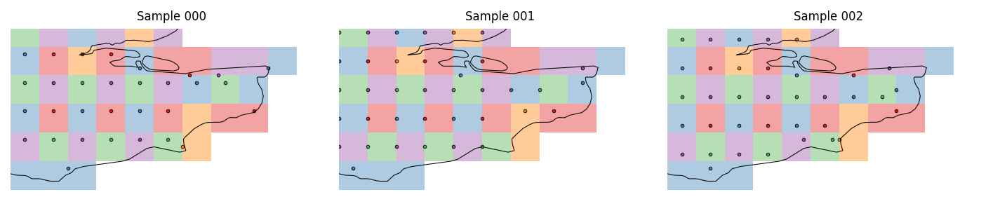

# uk-geo

Generates a structured grid of geographic points covering the UK, and partitions them into groups suitable for batched weather API calls.

## Purpose

The wider pv-prospect project trains a model of UK-wide PV power output using weather data fetched from a third-party API. Because the API is called on a schedule and accepts a limited number of locations per request, coverage of the UK must be achieved across consecutive time steps rather than in a single call. The goal is to partition the UK into groups of locations such that, over a sequence of time steps, every part of the UK is visited as evenly and as frequently as possible.

## Approach

A regular lat/lon grid of points is generated across the UK landmass and partitioned into _supercells_ — groups of geographically contiguous grid squares. Each supercell corresponds to one API call. The points within each supercell are sequenced so that consecutive time steps sample spatially distant locations: at time step _i_, the API is called with the _i_-th point from each supercell. Taken together, the set of points called at time step _i_ (one per supercell) gives broad, roughly uniform coverage of the UK.

To achieve this, points within each supercell are ordered using the **R2 low-discrepancy sequence**, which is based on the plastic constant (ρ ≈ 1.3247). This sequence has a toroidal property — it treats the grid as wrapping around at its edges — which ensures that adjacent supercells do not place their _i_-th points at correlated positions along their shared boundary.

Once ordered, the sequence of points in each supercell is cycled to fill a fixed-length sample file, so every time step has full UK coverage with no gaps.

## Outputs

| Output                             | Description                                                                                                                          |
|------------------------------------|--------------------------------------------------------------------------------------------------------------------------------------|
| `grid_cells/cell_*.csv` (Optional) | One file per supercell; rows are the ordered sequence of (lat, lon) points                                                           |
| `grid_point_samples/sample_*.csv`  | Transposition of the above; the _i_-th file contains one point per supercell, forming the set of locations to query at time step _i_ |
